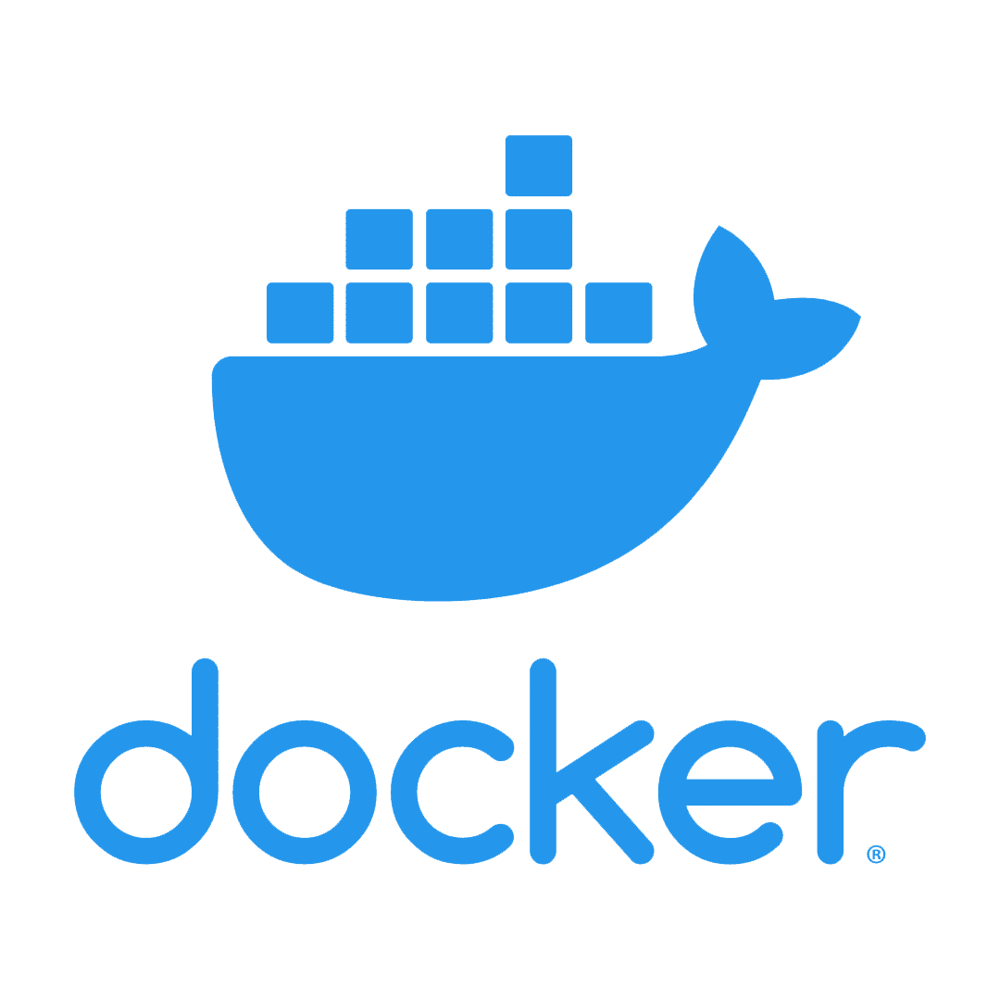
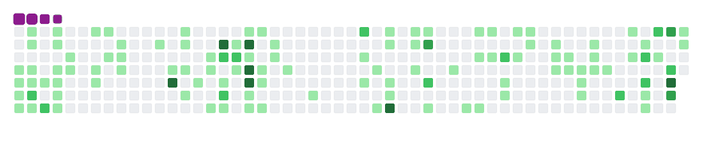

<!-- Greeting -->

   <h1>Hi, I'm Hussein</h1>

<!-- About -->

   <h2>About me:</h2>
   
I am Always eager to learn new technologies and techniques and improve my skills.and looking forward to collaborating and contributing to open-source projects.
   <a href="https://husseincopol.github.io/" target="_blank">Check out the projects I worked on</a>
   </b>

 

<!-- Social Platforms -->

   <h2>Connect with me:</h2>
   <code></code>
   <code></code>
   <code></code>

<!-- Languages & Tools -->

   <h2>Languages & Tools:</h2>
   <code></code>
   <code></code>
   <code></code>
   <code></code>
   <code></code>
   <code></code>
      <code></code>
   <code></code>
   <code></code>
   <code></code>
   <code></code>
   <code></code>
   <code></code>
   <code></code>

<!-- Contribution Graph -->

  <h3>contribution Graph get eaten by Python 🐍</h3>
  

<!-- Contribution Graph -->

